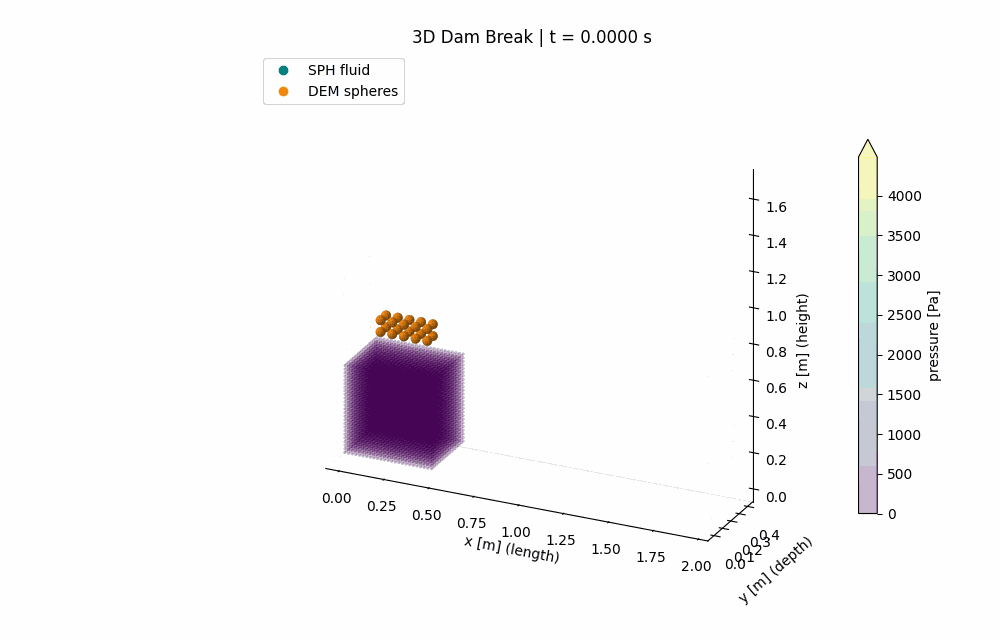
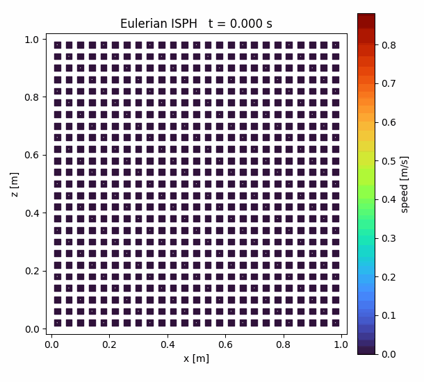

# Warp 3D SPH–DEM Dam Break

3차원 WCSPH Dam Break에 DEM 구 20개를 낙하시킨다. x는 수조 길이, y는 깊이,
z는 높이이고 중력은 −z 방향이다. SPH와 DEM은 xyz 병진 운동을, DEM은 xyz 회전도 계산한다.

## 시뮬레이션 결과

### 3D SPH–DEM Dam Break

현재 입력 파일의 DEM 구 20개를 사용해 9,000 step(0.9 s) 계산한 결과다. 101프레임으로 저장했다.



### Eulerian ISPH Lid-Driven Cavity

현재 입력 파일의 Re=100, 25×25 고정 유체점으로 5,000 step(10 s) 계산한 결과다. 51프레임으로 저장했다.



## 실행

Python 3.10 이상과 `requirements.txt` 패키지가 필요하다. 검증 환경은
Python 3.12, Warp 1.17.0, Matplotlib 3.9.2, Windows, NVIDIA GTX 1080이다.

```powershell
py -3.12 -m pip install -r requirements.txt
py -3.12 -m input_gen.generate
py -3.12 main.py --device cuda:0
py -3.12 main.py --device cpu
py -3.12 main.py --steps 100 --output-step 50 --no-gif --output-dir results/3d_smoke
py -3.12 main.py --no-dem --output-dir results/sph_only_3d --animation-dir animation/sph_only_3d
py -3.12 -m unittest discover -s tests -v
```

`--dt`, `--animation-dir`, `--input-dir`도 지정할 수 있다.
`input/Config.py`와 `input/Config_SPH_DEM.py`의 `Solv`는 SOPHIA의 `solv.txt`처럼
계산 방법·유체 물성·시간·출력 설정을 보관한다. 후자는 WCSPH–DEM 기본값만 덮어쓴다.
입자 배치·초기 속도·질량·밀도와 DEM 물성은 `input_file`의 텍스트 파일에서 읽는다.
상대 `input_dir`는 프로젝트 루트를 기준으로 해석하며 절대 경로도 가능하다.
기본 출력은 `result/3d`, `animation/3d`에 저장한다. 이전 2D 출력과 소스 백업
`results/2d_baseline/source.zip`은 별도로 보존했다.

## Eulerian ISPH Lid-Driven Cavity

고정된 x–z 셀 중심 입자에서 2차원 비압축성 Eulerian ISPH를 실행한다.
`input/Config.py`와 `input/Config_SPH_DEM.py`는 동일한 계산 설정 필드와 메서드를
사용하며, 각각 EISPH와 WCSPH–DEM 기본값을 저장한다. SPH/EISPH는 공통 `Solv.h`를
사용하고 `support=2*h`는 자동 계산한다. EISPH 동점성계수 `nu`는 직접 지정한다.

```powershell
py -3.12 main_EISPH.py --device cuda:0
py -3.12 main_EISPH.py --device cpu --steps 200 --output-step 20
```

`input_gen/gen_eisph.py`가 전처리 단계에서 정사각 cavity와 대칭 ghost를 만든다.
`main_EISPH.py`는 `input_reader`로 파일을 읽고, `source/EISPH.py`가
Eulerian 대류·점성 predictor, SOPHIA식 단일 패스 대각 pressure update,
velocity projection을 수행한다.
EISPH 커널은 공통 Wendland·KGC(`KERNEL_EISPH_KNL.py`), mirror 경계조건
(`KERNEL_EISPH_BC.py`), 대류·점성 predictor(`KERNEL_EISPH_force.py`), 압력 갱신
(`KERNEL_EISPH_PPE.py`), projection·진단(`KERNEL_EISPH_step.py`)으로 나뉜다.
유체와 경계는 모두 `EISPHptl` 하나를 사용하며 위치는 갱신하지 않는다. 고정된 유체·경계
HashGrid와 kernel-gradient correction은 실행 초기에 한 번만 구성한다. 위쪽 ghost에는
이동 lid, 나머지 ghost에는 no-slip 벽 조건을 적용한다. `Kernel_Dirichlet_BC`는 ghost별
`vel_bc`를 사용하므로 정지 벽, 이동 벽, 비균일 지정 속도를 같은 식으로 처리한다. 결과는 속력장과 속도 벡터를 담은
`animation/lid_driven_cavity.gif` 하나로 저장한다. 표시 범위는 읽은 입자 좌표에서 구하고
색상은 실제 속력 [m/s]이다. `--h`, `--nu`, `--input-dir`, `--no-gif`를 지정할 수 있으며
기존 `--dx`, `--reynolds` 생성 옵션은 전처리 설정으로 이동했다. 기본 조건은 Re=100, 25×25 유체점,
dt=0.002 s, 5,000 step이다.

PPE는 이전 압력의 이웃 기여를 고정한 뒤 대각 관계로 새 압력을 한 번 계산하며,
Jacobi 반복과 완화계수를 사용하지 않는다. predictor/PPE/projection 구성은
[SOPHIA Fluidized Bed 코드](https://github.com/hojin9908/Fluidized_bed_master)를 기준으로
차원 축소했으며, 폐 cavity PPE에는 RHS 평균 제거와 전체 압력의 공통 gauge 이동을 추가했다.
PDF와 같이 $A_{ij}=2V_j(\mathbf r_{ij}\cdot\widetilde{\nabla_iW}_{ij})/
r_{ij}^2$를 사용하므로 $A_{ij}$는 일반적으로 음수이다.
`EISPHptl.Aij[i]`에는 $\sum_j A_{ij}+\sum_{bj}A_{i,bj}$,
`bi[i]`에는 먼저 $b_i^{\mathrm{raw}}=\rho_0D_i^*/\Delta t$를 저장한 뒤
$b_i^{t+1}=b_i^{\mathrm{raw}}-N_f^{-1}\sum_k b_k^{\mathrm{raw}}$로 평균을 제거하며,
`Aijpj[i]`에는 $\sum_j A_{ij}p_j^t+\sum_{bj}A_{i,bj}p_{m(bj)}^t$를 저장한다.
별도 압력 커널은 이 세 값으로 $p_i^{t+1}$을 한 번 계산한다.
RHS 평균은 병렬 reduction으로 계산하며, projection 이후 진단용 이웃 순회는 저장 step과
마지막 step에만 수행한다.

## 기본 3D 조건

- 수조: 2 × 0.4 × 1 m (x × y × z; 길이 × 깊이 × 높이), 바닥과 네 측면, 상부 개방.
- 유체 블록: 0.5 × 0.4 × 0.5 m (x × y × z), 원점 (0, 0, 0), SPH 간격 0.02 m.
- 입자 수: SPH 유체 12,500개, 3겹 dummy 경계 48,336개.
- DEM: 반지름 0.025 m, 밀도 2500 kg/m³, 5 × 2 × 2 = 20개.
  중심 간격 0.065 m, 첫 중심 (0.12, 0.1675, 0.62) m, 초기 병진·각속도 0.
- 접촉: 강성 20,000 N/m, 감쇠계수 4 N·s/m, 마찰계수 0.3.
  구의 질량에 맞춰 설정한 예제 물성이며 경계도 같은 접촉 계수를 사용한다.
- DEM 경계: 반지름 0.01 m, 중심 간격 상한 0.02 m, 고정 구 14,688개.
- SPH smoothing length 0.026 m, 연계 smoothing length 0.08 m, 각각 support=2h.
- 공극률 범위 [0.05, 1], 시간 간격 0.0001 s, 9,000 step = 0.9 s.
  90 step마다 저장하므로 초기 상태를 포함해 101개 저장 상태를 만든다.

SPH 질량은 `rho0*dx³`이고, DEM은 구 체적 `V=(4/3)*pi*R³`, 질량 `m=rho*V`,
관성모멘트 `I=(2/5)*m*R²`를 사용한다. 단위는 체적 m³, 질량 kg, 힘 N,
토크 N·m, 관성모멘트 kg·m²이다. 구의 세 주관성모멘트가 같으므로 스칼라 `inertia`로
3축 각속도를 적분하며, 회전 대칭 형상에는 별도 자세각이 필요하지 않다.

`input_gen/config.py`의 `GenerationConfig` / `CoupledGenerationConfig`가 기존
`Solv`의 배치·초기 물성 기본값을 보존한다. 수조, `dx`, DEM 개수·초기 위치·속도,
반지름, `dem_K/eta/mu/h`, cavity 크기·lid 속도를 여기서 바꾸고 파일을 재생성한다.
생성 설정은 실행 중 읽지 않는다. 파일을 직접 편집한 뒤 생성기를 실행하면 편집값이
교체되므로, 두 실행 진입점은 입력 파일을 자동 생성하지 않는다.

실행 시 `validate_sph()`는 공통 계산 설정을, `input_reader`는 읽은 물리량과
시간 간격을 검사한다. SPH 초기 음향 제한은 `dt <= 0.25*h/c0`이다.
DEM은 실제 입자 질량의 최솟값과 강성·감쇠 최댓값으로 보수적인 접촉 제한을 검사한다.
EISPH는 읽은 `sqrt(m/rho)`와 지정 경계 속도로 초기 predictor 제한을 검사한다.
시간 간격은 자동 조절하지 않는다.

## 입자 입력 형식

`input/input_reader.py::input_parser(path, kind=None, device="cpu")`는 SOPHIA처럼
첫 행의 정수 ID에 따라 각 열을 구조체 필드에 할당한다. ID는 Notion 표 순서에
따라 각 파일에서 1부터 시작하고, 벡터는 x/y/z 순으로 펼친다. SOPHIA 원본의
숫자 ID와는 다르다. 열 순서는 헤더와 데이터를 함께 이동하여 바꿀 수 있다.
압력·가속도·힘·필터·공극률·PPE·접촉 이력 등 계산 필드에는 ID가 없다.

| 파일 | 입력 필드 순서 | 기본 입자 수 |
| --- | --- | ---: |
| `input_SPH.txt` | pos, vel, rho, m | 12,500 |
| `input_BND.txt` | pos, vel, rho, m | 48,336 |
| `input_DEM.txt` | pos, vel, omega, radius, rho, m, inertia, K, eta, mu, h | 20 |
| `input_DEMBND.txt` | pos, vel, omega, radius, rho, m, inertia, K, eta, mu | 14,688 |
| `input_EISPH.txt` | pos, vel, rho, m | 625 |
| `input_EISPHBND.txt` | pos, vel_bc, rho, m, mirror | 336 |

상세 숫자 ID·단위·초기화 규칙은 [입력 파일 설명](input_file/README.md)과
[Notion 대응표](https://app.notion.com/p/3d5359e0c6458048acb9c77f79fd4608)에 있다.
`mirror`는 EISPH 유체 파일의 0-based 데이터 행 번호이며, ghost 속도는
`2*vel_bc-fluid.vel[mirror]`로 초기화한다. DEM 체적은 반지름에서 계산하고
질량과 밀도의 일관성을 검사한다. 모든 입력 열은 필수이며 중복·미지정 ID,
비유한 값, 잘못된 행 길이, 유효하지 않은 물성과 mirror 번호는 오류다.
이는 초기조건 입력이며 계산 중 압력이나 접촉 이력까지 복원하는 재시작 기능은 아니다.

## 자료구조와 경계

| 구조체 | 인덱스 | 저장 내용 |
| --- | --- | --- |
| `SPHptl` | 자신 i, 이웃 j | SPH 물리량, `porosity`, `pgf=-grad(p)`, 항력 반작용 `acc_dem` |
| `BNDptl` | 자신 bi, 이웃 bj | 고정 SPH dummy 경계 |
| `DEMptl` | 자신 a, 이웃 b | 구의 위치·속도·힘·각속도·토크·물성·접촉 이력·유체 연계력 |
| `DEMBNDptl` | 이웃 dbj | 위치·반지름과 0인 속도·각속도를 제공하는 kinematic 고정 구 |

실행 경로에서는 `input_parser()`가 SPH 연계 필드와 DEM old/new CSR까지 초기화한다.
기존 `input/gen_*.py`는 전처리 모듈로 연결하는 호환 import만 남겼다. 별도 연계 구조체나
전달 변수 없이 `P_sph`의 필드를 직접 읽고 쓴다. `P_sph.acc_dem`은 DEM 항력의
기여분이고 `P_sph.acc`는 적분에 사용하는 총가속도다.

SPH와 DEM 경계는 z=0 바닥, x 양쪽, y 앞·뒤의 다섯 면에서 모서리와 꼭짓점을 중복 생성하지 않는다.
DEM 경계 중심은 수조 표면에서 경계 반지름만큼 바깥에 있다. 고정 구의 곡면으로
경계를 표현하므로 접촉 표면은 거칠다. 경계 구의 간격은 이동 구가 격자 사이를
통과하지 못하도록 검사한다. 경계 구에는 힘·토크·가속도를 저장하거나 적분하지 않는다.
벽 접촉력과 접촉 토크는 이동 DEM에만 누적하며 고정 지지대의 반력은 모델링하지 않는다.

접촉 이력은 모든 입자쌍의 dense 행렬 대신 **활성 접촉만 담는 CSR**로 저장한다.
DEM–DEM은 `contact_dem_offset_old/new[N+1]`, `contact_dem_id_old/new[E]`,
`tang_dem_old/new[E]`, DEM–경계는 `contact_bnd_offset_old/new`,
`contact_bnd_id_old/new`, `tang_bnd_old/new`를 사용한다. 여기서 E는 해당 step의
방향성 활성 접촉 수이며 시뮬레이션 전에 정하는 값이 아니다.
ID는 HashGrid의 열거 순서가 아니라 안정적인 입자 인덱스이므로, 계속 접촉 중인 쌍의
접선 이력은 grid를 다시 구성해도 승계되고 끊긴 접촉은 새 CSR에서 자연스럽게 사라진다.

각 접촉 종류는 `new 초기화 → count → new offset in-place exclusive scan → new fill →
old/new swap` 순서로 갱신한다. `*_old`는 kernel이 읽는 직전 current CSR이고 `*_new`는
이번 step의 출력 목적지다. 길이 `N+1`인 `offset_new`의 앞 N칸에 행별 접촉 수를 쓴 뒤
같은 배열에 prefix scan하여 offset으로 바꾼다. 마지막 offset에서 E를 읽고 정확히 E개인
`id_new`/`tang_new`를 구조체 필드에 할당한다. fill kernel은 `*_old`에서 stable ID가 같은
접촉의 이력을 찾아 `*_new`에 쓰고, 완료된 세 필드를 swap하여 `*_old`를 다음 step의
current/read 상태로 만든다. 따라서 `Simulation.py`에는 별도 지역 CSR 배열이나 수명 유지용
tuple이 없다. 고정 슬롯 K와 overflow flag도 없으며, 두 접촉 경로가 공유하는 내부 호출은
접촉 물리식 `DEM_contact` 하나뿐이다.

두 접촉 종류의 old/new 필드를 합친 영구 저장량은 대략
`16*(N+1) + 16*(E_dem_old+E_dem_new+E_bnd_old+E_bnd_new)` byte다
(int32 ID 4 byte + vec3 이력 12 byte). swap 뒤 `*_new`에는 안전한 비동기 수명과 다음
step 재사용을 위해 퇴역한 직전 배열이 남는다. 따라서 저장량은 `O(N+E_current+E_retired)`이며,
E 자체가 병적으로 O(N²)인 실제 전입자 접촉 상태가 아니라면 N×N으로 선할당되지 않는다.
CUDA 메모리 풀의 예약량은 재사용을 위해 최고점에 머물 수 있으므로 프로세스 예약 메모리와
현재 배열의 논리적 크기는 구분해야 한다.

각 종류마다 count와 fill을 위한 HashGrid 순회가 한 번씩 필요하고, E 크기의 배열을
할당하기 위해 scan의 마지막 값을 host에서 한 번 읽는다. CSR offset이 int32이므로
방향성 접촉 수는 `E < 2^31`이어야 한다. 호출 전 이동 HashGrid는 현재 위치로 rebuild되어
있어야 하며 `radius_max`는 해당 이웃 집합의 실제 최대 반지름 이상이어야 한다.

## 한 스텝의 흐름

`main.run_forward`가 이동 입자의 3차원 HashGrid를 갱신하고 `SPHDEM_OneStep`을 호출한다.
고정 경계의 grid는 처음 한 번 빌드한다.

1. 기존 SPH Shepard → 밀도 → Tait 압력 → 압력력·점성력·중력. 적분은 보류한다.
2. DEM–DEM `offset_new` 초기화 → `Kernel_count_dem_contacts` → in-place scan →
   `Kernel_force_dem` → old/new swap: 접촉 이력과 힘·토크·중력을 계산.
3. boundary `offset_new` 초기화 → `Kernel_count_bnd_contacts` → in-place scan →
   `Kernel_bc_dem` → old/new swap: 벽 접촉 이력과 이동 DEM의 힘·토크를 계산.
4. `Kernel_prep_sphdem`: SPH 위치의 공극률과 음의 압력구배를 `P_sph`에 저장.
5. `Kernel_interaction_dem`: 유체장 보간으로 DEM 압력력·반암시적 항력 계산.
6. `Kernel_interaction_sph`: 항력 반작용을 `P_sph.acc_dem`에 기록하고 `P_sph.acc`에 더함.
7. `Kernel_step_sph`와 `Kernel_step_dem`: 같은 시간층에서 계산한 힘으로 xyz 적분.

Shepard는 첫 step에서 초기화하고 이후 `shepard_step` 주기로 갱신한다.
중력 벡터 `(0, 0, -g)`는 각 상에서 한 번만 더한다. 고정 경계는 적분하지 않는다.

## 수식과 참조

공통 `kernel/Kernel_KNL.py`의 Wendland C2 정규화를 3D로 바꿨다.
`q=r/h`, `u=1-q/2`, `q<2`에서

```text
W(r,h) = 21/(16*pi*h³) * u⁴ * (1+2q)
dW/dr  = 21/(16*pi*h⁴) * (-5q*u³)
```

support 밖에서는 0이며 구 체적에 대한 적분은 1이다.
[PySPH의 Wendland C2 구현](https://pysph.readthedocs.io/en/main/_modules/pysph/base/kernels.html#WendlandQuintic)과 계수를 대조했다.
`KERNEL_rho.py`, `KERNEL_pres.py`, `KERNEL_step.py`의 소스는 3D 전환 전과 같다.
`KERNEL_force.py`는 기존 벡터식을 유지하되 중력 성분만 `(0, 0, -g)`로 맞췄다.
이 커널들은 3D 커널·체적 질량·이웃을 사용한다.
`kernel/__init__.py`는 원래 파일명과 `KERNEL_KNL` import의 대소문자를 연결한다.

DEM 접촉과 SPH–DEM 연계식은 [DEM_HeatTransferModelV2](https://github.com/hojin9908/DEM_HeatTransferModelV2/tree/18b2e46cb66590531f565903acda3d5d18d899c5)를 따른다.

- [function_DEM_INTERACTION.cuh](https://github.com/hojin9908/DEM_HeatTransferModelV2/blob/18b2e46cb66590531f565903acda3d5d18d899c5/function_DEM_INTERACTION.cuh): 선형 스프링·감쇠, 접선 이력, 성분별 마찰 제한, 3축 외적 토크.
- [function_PREP.cuh](https://github.com/hojin9908/DEM_HeatTransferModelV2/blob/18b2e46cb66590531f565903acda3d5d18d899c5/function_PREP.cuh), [function_ALE.cuh](https://github.com/hojin9908/DEM_HeatTransferModelV2/blob/18b2e46cb66590531f565903acda3d5d18d899c5/function_ALE.cuh): 공극률과 차분 압력구배.
- [function_SPH_DEM_COUPLING.cuh](https://github.com/hojin9908/DEM_HeatTransferModelV2/blob/18b2e46cb66590531f565903acda3d5d18d899c5/function_SPH_DEM_COUPLING.cuh): 압력 보간, Ergun/Wen–Yu 항력, SPH 반작용.

유체 보간과 항력 반작용은 동일한 연계 커널과 유체 이웃 집합을 사용한다.
연계 smoothing length는 `P_dem.h[a]`이며 반작용도 해당 DEM의 h를 사용한다.
탐색 최대 반지름과 최대 h는 실제 입자 배열에서 구해 실행 시작 시 보관한다.
서로 다른 h에서는 SPH 위치의 각 고체 기여를 해당 DEM의 h로 계산한 유체-only
kernel sum으로 정규화한다. 같은 h에서는 기존 공통 h 정규화로 환원된다.
접촉식은 기존처럼 이동 subject의 `K/eta/mu`를 사용한다. 고정 DEM 경계의
접촉 물성은 저장되지만 현재 접촉식에는 사용되지 않는다.
압력력은 `V*<−grad(p)>`, 항력은 `m*c/(1+dt*c)*(u_f-v_dem)`이다.
유체 이웃이 없으면 이전 항력과 압력력을 지운다. 원본의 gradient correction 대신
현재 솔버의 보정 없는 3D Wendland gradient를 사용한다.

참조 반작용은 **공극률을 고정한 교환 단계에서 `epsilon_i*m_i`로 가중한 SPH 운동량**과
DEM 항력을 상쇄한다. 기존 WCSPH 방정식을 유지하므로 전체 ISPH를 재현하거나
시간에 따라 공극률이 변하는 전체 시스템의 총 운동량 보존을 보장하지 않는다.
압력력은 DEM에 보간하고 SPH로는 항력만 반작용한다. 접촉의 성분별 마찰 제한과
비투영 접선 이력도 참조식을 유지한다.

공극률 기반 미해상 연계이므로 DEM 표면의 유체 비침투를 직접 강제하지 않아
SPH 점과 DEM 구가 겹칠 수 있다. 열전달은 구현 범위에 포함하지 않는다. DEM 접촉 경로는
명시적인 old/read–new/write CSR을 사용하는 forward-only 계산이며 backward 실행은 지원하지 않는다.

## 출력과 검증

- `result/3d/sph.pvd`: SPH 유체(type=1), dummy 경계(type=0). xyz 위치, 속도, 밀도,
  압력, 질량, 공극률, 음의 압력구배, DEM 항력 반작용 가속도를 저장한다.
- `result/3d/dem.pvd`: DEM 구(type=2), 고정 DEM 경계(type=3). 이동 DEM의 xyz
  물리량과 반지름·물성·유체 연계량을 저장한다. 고정 경계는 기하·물성만 가지며
  이동 전용 가속도·힘·토크 출력에는 0 placeholder를 사용한다.
- 각 PVD는 동일한 시간의 `sph_*.vtp`, `dem_*.vtp`를 가리킨다.
- `animation/3d/dam_break_sph_dem_3d.gif`: 모든 SPH 점과 실제 반지름의 DEM 구를
  3D로 표시한다. 물리 z축을 수직으로 그리며 각 축의 길이 비율을 유지한다.
  SPH 색상은 압력, DEM은 주황색이다. 고정 경계는 입력 좌표의 표본 점으로 표시한다.
  유체 내부의 구를 확인할 수 있도록 DEM 표면을 반투명 SPH 점 위에 겹쳐 표시한다.
- `save_gif(..., axis_limits=((xmin,ymin,zmin),(xmax,ymax,zmax)))`로 모든 프레임에
  동일한 물리 축 범위를 강제할 수 있다. 생략하면 전체 이동 입자를 포함하는 범위를 사용한다.
- `animation/dam_break_sph_dem_100_2s.gif`: 현재 z-up 코드로 DEM 100개
  (`10×2×5`, x×y×z)를 2.0 s 계산한 201프레임 결과다. 이전 1초 결과와 같은 고정 축
  `x=[-0.06,2.06]`, `y=[-0.06,0.46]`, `z=[-0.06,2.06]` m를 사용한다.
- 초기 상태와 마지막 상태는 출력 주기에 맞지 않아도 저장한다 (`output_step > 0`).

파일 입력 전환 후 테스트 45개가 통과했다. 기존 35개 물리 회귀 검증에
6종 파일 배열 비교, 열 순서 변경, 잘못된 입력과 mirror 검출, CPU/CUDA의
파일/생성 경로 궤적 비교, DEM 입자별 h의 공극률 가중 항력 반작용 검증을 추가했다.
기본 6종 파일의 초기 배열은 변경 전 저장한 원본 배열과도 비교해 일치를 확인했다.
두 실행 파일을 CPU/CUDA에서 짧게 실행했고 SPH-only 및 GIF/VTK 출력도 확인했다.
−z 중력 방향, 커널 체적 적분·미분, 3D 질량·관성·경계 기하, 사선 접촉,
앞뒤 벽의 이동 DEM 반발력, 3축 회전·압력구배·항력, 공극률 가중 반작용, 접촉 이력 해제,
빈 old/new CSR 할당·정확한 E 크기·0→증가→비영(非零) 감소→0→재접촉·행의 접촉 교체,
경계 CSR 증가와 해제, HashGrid rebuild 뒤 stable-ID 이력 승계, SPH 전용 경로,
EISPH 단일 압력 갱신식·cavity 순환·출력·GIF를 확인한다.
물리 커널은 CPU와 CUDA에서 검사했다.
EISPH는 Ghia Re=100 기준해와 정량 비교했다. 다른 모델의 실험 자료 검증과
격자·시간 간격 수렴성 검증은 수행하지 않았다.

EISPH Re=100, 25×25, 5,000 step 결과는 모든 값이 유한하고 고정 위치·no-slip 오차가 0이다.
상대 PPE 잔차는 3.80e-6, 중심 속도 `(u,w)=(-0.1906,0.0563)`이며
`animation/lid_driven_cavity.gif`에 51프레임으로 저장했다.
Ghia et al.의 Re=100 비벽면 중심선 30점을 보간 비교한 통합 RMSE는 0.00840,
최대 절대오차는 0.01550이다.

아래 장기 실행 결과는 old/new CSR 전환과 z-up 좌표 전환 전의 dense/y-up 물리 baseline이다.
현재 CSR·z-up 경로에서는 35개 회귀 테스트를 통과했으며 9,000 step 장기 재검증은 아직 수행하지 않았다.
기본 3D 조건으로 9,000 step(0.9 s)을 실행해 SPH·DEM VTP 각각 101개와
3D GIF 101프레임을 생성했다. 모든 저장 물리량이 유한하고 SPH·DEM 경계의 위치와
속도가 초기값과 같았다. 저장 프레임에서 최대 DEM–DEM 겹침은 0.003999 m,
DEM–경계 겹침은 0.003787 m로 구 지름 대비 약 8.0%, 7.6%이다. 이는 연성 접촉
예제의 저장 시점에서 측정한 값이며 전체 step 최대값이나 접촉 정확도의 수렴 검증은 아니다.
